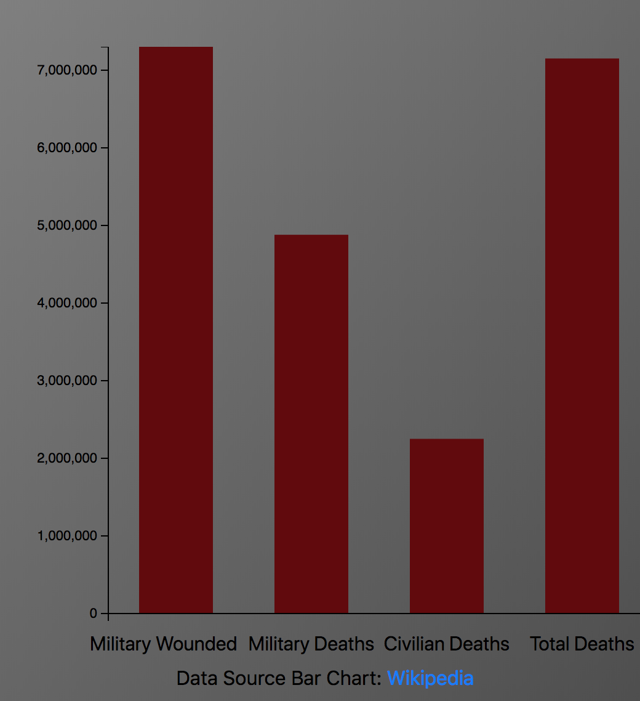
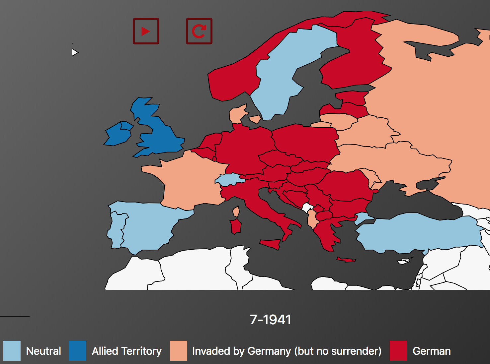
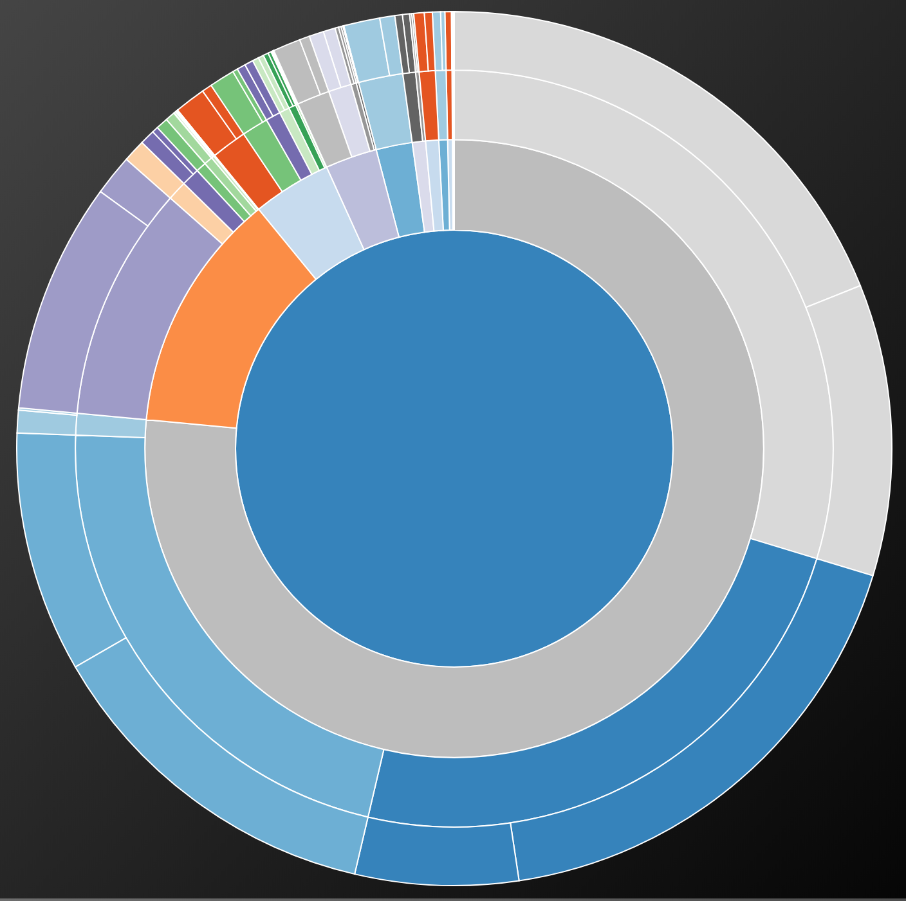

# FinalMinorProject
Final project of the Minor Programmeren at the University of Amsterdam

## Demo
https://jitses.github.io/FinalMinorProject/code/main.html

### General Information
Developer: Jitse Schol

Application Name: World War 2 Visualisation

The purpose of the web page is to provide information about the Second World War. The web page is mainly intended for people that have an interest in the Second World War. Furthermore, some information could be used by history teachers, as education material. Especially the map, can be a very convenient tool in teaching. It shows how the Second World War evolved over time in a way that is very easy to understand.
The bar chart and sunburst consist of more in depth information. The bar chart shows the casualties data per country, whereas the sunburst shows data on casualties in several significant battles.

### Images

### Libraries used to build this project
code/libraries/datamaps.world.min.js, retrieved from https://github.com/markmarkoh/datamaps

License datamaps: https://github.com/markmarkoh/datamaps/blob/master/LICENSE

D3 library for graphs: https://github.com/d3/d3

License D3: https://github.com/d3/d3/blob/master/LICENSE

D3 tip for tooltip barchart: https://github.com/Caged/d3-tip

License D3 tip: https://github.com/Caged/d3-tip/blob/master/LICENSE

Bootstrap: https://github.com/twbs/bootstrap

License Bootstrap: https://github.com/twbs/bootstrap/blob/v4-dev/LICENSE

Jquery: https://github.com/jquery/jquery

License Jquery: https://github.com/jquery/jquery/blob/master/LICENSE.txt

Topojson: https://github.com/topojson/topojson

License Topojson: https://github.com/topojson/topojson/blob/master/LICENSE.md

Font Awesome (icons): https://github.com/FortAwesome/Font-Awesome

License Font Awesome: https://github.com/FortAwesome/Font-Awesome/blob/master/LICENSE.txt

Popper.js (for dropdown menu): https://github.com/FezVrasta/popper.js/

License Popper.js: https://github.com/FezVrasta/popper.js/blob/master/LICENSE.md

#### Sources found in my code all have their own licenses:

Licenses of sources that are used multiple times:

License Stackoverflow:

https://stackoverflow.com/help/licensing

License W3:

https://www.w3schools.com/about/about_copyright.asp

Sources found in createBarchart.js:

https://www.digitalocean.com/community/tutorials/getting-started-with-data-visualization-using-javascript-and-the-d3-library

License: Creative Commons Attribution-NonCommercial-ShareAlike 4.0 International License.

https://stackoverflow.com/questions/3450593/how-do-i-clear-the-content-of-a-div-using-javascript

https://www.w3schools.com/js/js_htmldom_css.asp

http://learnjsdata.com/read_data.html

License: CC0, or Public Domain where applicable (https://github.com/vlandham/js_data)

http://bl.ocks.org/d3noob/8952219
No License

http://bl.ocks.org/Caged/6476579

No License

http://alignedleft.com/tutorials/d3/making-a-bar-chart

Copyright is by Scott Murray, could not find license

http://www.d3noob.org/2012/12/adding-axis-labels-to-d3js-graph.html

Could not find license

Sources found in createMap.js:

https://bl.ocks.org/briwa/60024d70a5aee921d5910828fe8115be

No License

http://datamaps.github.io

License datamaps: https://github.com/markmarkoh/datamaps/blob/master/LICENSE

Sources found in createSunBurst.js:

https://bl.ocks.org/mbostock/4348373

License: GNU General Public License, version 3.

https://stackoverflow.com/questions/13437446/how-to-display-selected-item-in-bootstrap-button-dropdown-title

Sources found in interval.js:

https://stackoverflow.com/questions/37187504/javascript-second-counter

https://codepen.io/MarioDesigns/pen/ENevMJ

License: MIT (https://blog.codepen.io/legal/licensing/)

https://stackoverflow.com/questions/109086/stop-setinterval-call-in-javascript

https://stackoverflow.com/questions/5404839/how-can-i-refresh-a-page-with-jquery

Sources found in scroller.js:

https://stackoverflow.com/questions/2659354/jquery-scroll-down-page-a-set-increment-in-pixels-on-click

Source found in convertCSVtoJSON.py:

https://stackoverflow.com/questions/19697846/how-to-convert-csv-file-to-multiline-json

Source found in stylesheet.css:

https://css-tricks.com/snippets/css/text-rotation/

License: https://css-tricks.com/license/

Sources found in main.html:

https://getbootstrap.com/docs/4.0/getting-started/introduction/

https://maxcdn.bootstrapcdn.com/bootstrap/4.0.0/css/bootstrap.min.css

https://maxcdn.bootstrapcdn.com/bootstrap/4.0.0/js/bootstrap.min.js

https://getbootstrap.com/docs/4.0/components/dropdowns/

License Bootstrap: https://github.com/twbs/bootstrap/blob/v4-dev/LICENSE

https://cdnjs.cloudflare.com/ajax/libs/popper.js/1.12.9/umd/popper.min.js

License: https://github.com/FezVrasta/popper.js/blob/master/LICENSE.md

https://cdnjs.cloudflare.com/ajax/libs/font-awesome/4.7.0/css/font-awesome.min.css

License Font Awesome: https://github.com/FortAwesome/Font-Awesome/blob/master/LICENSE.txt

https://labratrevenge.com/d3-tip/javascripts/d3.tip.v0.6.3.js

License D3 tip: https://github.com/Caged/d3-tip/blob/master/LICENSE

https://www.w3schools.com/icons/tryit.asp?filename=tryicons_fa-play

https://www.w3schools.com/icons/tryit.asp?filename=tryicons_fa-play

https://www.w3schools.com/icons/tryit.asp?filename=tryicons_fa-repeat

https://www.w3schools.com/icons/tryit.asp?filename=tryicons_fa-chevron-circle-down

### License
Copyright (c) 2018 Jitses

MIT License
Permission is hereby granted, free of charge, to any person obtaining a copy
of this software and associated documentation files (the "Software"), to deal
in the Software without restriction, including without limitation the rights
to use, copy, modify, merge, publish, distribute, sublicense, and/or sell
copies of the Software, and to permit persons to whom the Software is
furnished to do so, subject to the following conditions:

The above copyright notice and this permission notice shall be included in all
copies or substantial portions of the Software.

THE SOFTWARE IS PROVIDED "AS IS", WITHOUT WARRANTY OF ANY KIND, EXPRESS OR
IMPLIED, INCLUDING BUT NOT LIMITED TO THE WARRANTIES OF MERCHANTABILITY,
FITNESS FOR A PARTICULAR PURPOSE AND NONINFRINGEMENT. IN NO EVENT SHALL THE
AUTHORS OR COPYRIGHT HOLDERS BE LIABLE FOR ANY CLAIM, DAMAGES OR OTHER
LIABILITY, WHETHER IN AN ACTION OF CONTRACT, TORT OR OTHERWISE, ARISING FROM,
OUT OF OR IN CONNECTION WITH THE SOFTWARE OR THE USE OR OTHER DEALINGS IN THE
SOFTWARE.
