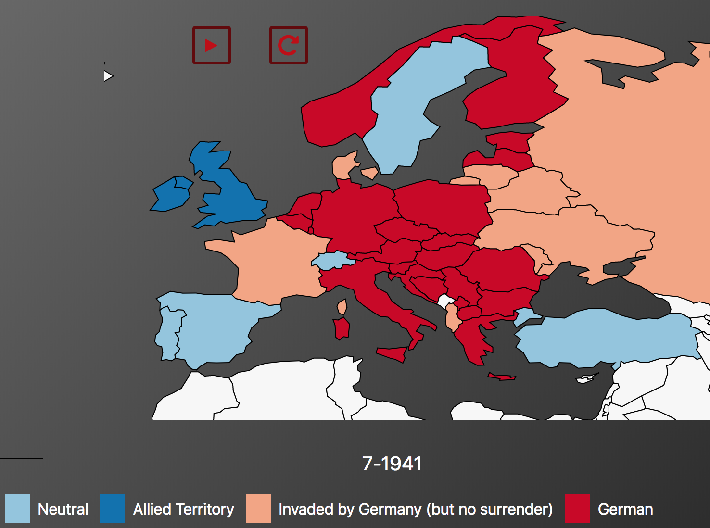

# FinalMinorProject
Final project of the Minor Programmeren at the University of Amsterdam

## Demo
https://jitses.github.io/FinalMinorProject/map_europe.html

### General Information
Developer: Jitse Schol
Project Name: World War 2 Visualisation

The purpose of the web page is to provide information about the Second World War. The web page is mainly intended for people that have an interest in the Second World War. Furthermore, some information could be used by history teachers, as education material. Especially the map, can be a very convenient tool in teaching. It shows how the Second World War evolved over time in a way that is very easy to understand. 
The bar chart and sunburst consist of more in depth information. The bar chart shows the casualties data per country, whereas the sunburst shows data on casualties in several significant battles. 

### Images

