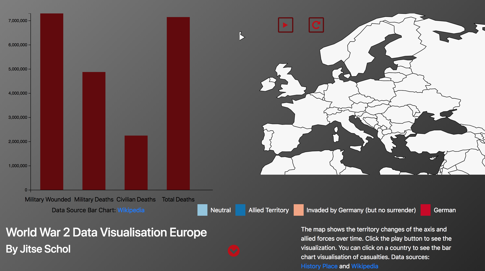

# Report
The application shows important information about the Second World War. It consists of a map, a bar chart and a sunburst graph. The bar chart is linked to the map, showing casualties in a country during the second world war. The map has a play button, when clicked showing the territory changes in colour over time of the German and allied forces. The sunburst dataset consists of significant battles during the second world war. A user can zoom in on a particular country and see the battles in that country, along with the casualties on the axis and allied side per battle.

